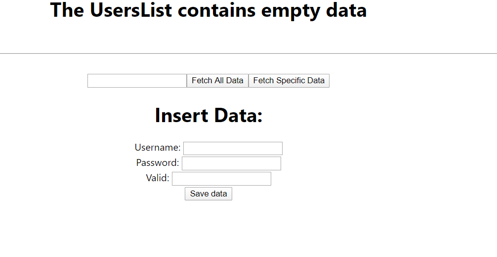

# MERN-App 

This is the simple MERN (MongoDB, Express, ReactJS, NodeJs) Application.

#### Below is the screenshot of this project:
1. 
2. 
1. Create React Application using *"npx install create-react-app student-app"* command.
2. *"npm install -g express generator"* used to install Node App.
3. Then use command __"express"__. It give sthe Node structure.
4. Install MongoDB and create connection.
5. Integrate MongoDB in Node Application using MongoClient.
6. Run the NodeJs Application using ***"node app.js"*** command, and React App using ***"npm start"*** command.
